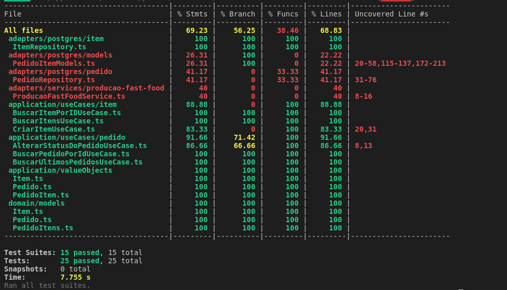

# TechChallenge: Microsserviço de Pedidos

## Introdução

Bem-vindo à documentação do projeto para o sistema de gerenciamento de pedidos. Este guia fornece instruções detalhadas sobre como configurar, executar e interagir com a API Pedidos.

## Pré-requisitos

Antes de iniciar, certifique-se de ter as seguintes ferramentas instaladas em sua máquina:

```
- Docker & Docker Compose
```

## Configuração do Projeto

1.  **Clone o Repositório:**
	```bash
	git clone git@github.com:techChallenge-SOAT/pedidos-fast-food.git
	cd pedidos-fast-food
	git clone git@github.com:techChallenge-SOAT/pedidos-fast-food.git
	cd pedidos-fast-food
	```

2. **Suba a aplicação:**

## Docker

-  **Subir projeto**

	```bash
	docker-compose up
	```
- **Desligar Projeto**
	```bash
	docker-compose down
	```

# Rotas da API

**Acesso à API:**
- A API estará disponível em `http://localhost:3000` por padrão.

## Items

 1. **Criar Item**
	 - **Método:** `POST`
	 - **Endpoint:** `/itens`
	 - **Exemplo Requisição:**

```json
{
	"categoria":"Lanche",
	"nome":"Hambúrguer com Queijo",
	"descricao":"Delicioso hambúrguer grelhado com queijo derretido",
	"preco_unitario":39.99
}
```
2. **Consultar item específico**
	- **Método:** `GET`
	- **Endpoint:** `/itens/{uuid}`
	- **Exemplo Requisição:**

		```bash
		GET localhost:3000/itens/670d7b97-e82e-47f4-bb4a-cd3f05865c90
		```

4. **Consultar todos os itens**
	- **Método:** `GET`
	- **Endpoint:** `/itens`
	- **Exemplo Requisição:**

		```bash
		localhost:3000/itens
		```

##  Pedidos

 1. **Criar Pedido**
	 - **Método:** `POST`
	 - **Endpoint:** `/pedidos`
	 - **Exemplo Requisição:**

		```json
		{
		    "cliente_cpf": "12345678900",
		    "itens": [
		      {
		        "item_id":"670d7b97-e82e-47f4-bb4a-cd3f05865c90",
		        "quantidade": 2
		      }
		    ]
		  }
		```
2. **Consultar pedido específico**
	- **Método:** `GET`
	- **Endpoint:** `/pedidos/{id}`
	- **Exemplo Requisição:**

		```bash
		GET localhost:3000/pedidos/1
		```
3. **Atualizar `status` pedido**
	- **Método:** `PATCH`
	- **Endpoint:** `/pedidos/{id}`
	- **Exemplo Requisição:**

		```json
		{
		"status":"pronto"
		}
		```
4. **Consultar todos os pedidos**
	- **Método:** `GET`
	- **Endpoint:** `/pedidos`
	- **Exemplo Requisição:**

		```bash
		localhost:3000/pedidos
		```

5. **Consultar status pagamento de um pedido**
	- **Método:** `GET`
	- **Endpoint:** `/pedidos/{id}/pagamento`
	- **Exemplo Requisição:**

		```bash
		localhost:3000/pedidos/{id}/pagamento
		```

# Caminho feliz para teste

### Funcionalidade: `Pedido`

**Contexto:**
*Dado* que eu tenha um item cadastrado

**Cenário:** `Realizar Pedido`

*Dado* que crie um pedido com pelo menos 1 item
*E* realize o pagamento do pedido
*Então* deve-se conseguir atualizar o status do pedido até finalizado

>[!NOTE]
>
>A seguir a ordem que deve ser chamado as APIs para realizar o cenário acima
>1. Criar Item
>2. Criar Pedido
>3. Gerar pagamento pedido
>4. Atualizar status Pedido para `em preparação`
>5. Atualizar status Pedido para `pronto`
>6. Atualizar status Pedido para `finalizado`


# Evidências de testes
- Testes 

